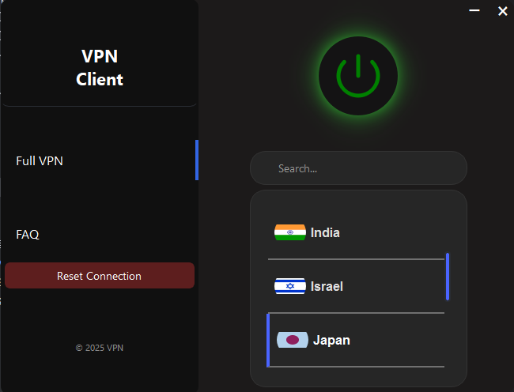

#  VPN Infrastructure Platform

[](https://github.com/michaelj-tech1/personal-vpn)

A multi-region OpenVPN platform deployed across **20 servers** to provide secure VPN access for **50+ users**, with automated provisioning and updates using **Ansible**, and a **Python (PySide6)** desktop client for connection management and status logging.

---


## Desktop client (PySide6)



## What this is

This project is a fully managed personal VPN “platform”:
=======
This project is a fully managed VPN platform:
- **Infrastructure:** 20 globally distributed Linux hosts running OpenVPN
- **Automation:** Ansible playbooks to provision, harden, and update nodes consistently
- **Security:** firewall rules + Fail2Ban to reduce attack surface and block abusive traffic
- **Client:** a desktop app for server selection, connect/disconnect, and basic logging

> If you’re here to reproduce it: you can, but you’ll need your own servers + domain/IPs.  
> If you’re here to review it (resume): start with the architecture section below.

---

## High-level architecture

```mermaid
flowchart LR
    U["User Device<br/>(OpenVPN Client / Desktop App)"] -->|"TLS VPN Tunnel"| S["VPN Server<br/>(OpenVPN on Linux)"]
    S -->|"NAT + Forwarding"| I["Internet"]

    A["Attacker / Bot"] -->|"SSH / VPN probes"| S
    F["Firewall Rules<br/>(UFW / iptables)"] --> S
    B["Fail2Ban<br/>(ban abusive IPs)"] --> S
    M["Ansible Control Node"] -->|"provision, config, updates"| S
